# ERD del núcleo Oracle

## Hook diferido a la fase 10

`Evidence.document_id` permanece nullable y sin clave foránea hasta introducir el esquema
autoritativo `Document`/`DocumentChunk` en la fase 10. `EvidenceDossier` contextualiza evidencia
en uno o varios `StrategicDossier` mediante un mapeo N:M tenant-safe. Al crear evidencia desde
una señal solo se mapea el expediente solicitado; el upgrade desde 0004 conserva evidencia
compartida creando un mapeo por cada `DossierSignal` existente. La fase 06
rechaza evidencia basada únicamente en documento. El resto de
relaciones no polimórficas usa claves foráneas tenant-safe. Las referencias polimórficas
(`Feedback.target_*`, `Task.linked_resource_*`, `ScoreHistory.resource_*`) se validan en los
servicios de dominio y no se falsean con una clave foránea incompleta.

```mermaid
erDiagram
  TENANT ||--o{ STRATEGIC_DOSSIER : owns
  WORKSPACE ||--o{ STRATEGIC_DOSSIER : contains
  STRATEGIC_DOSSIER ||--o{ DOSSIER_OBJECTIVE : defines
  STRATEGIC_DOSSIER ||--o{ HYPOTHESIS : tests
  STRATEGIC_DOSSIER ||--o{ WATCHLIST : monitors
  WATCHLIST ||--o{ SIGNAL_MONITOR : delegates
  TENANT ||--o{ SIGNAL : receives
  STRATEGIC_DOSSIER ||--o{ DOSSIER_SIGNAL : contextualizes
  SIGNAL ||--o{ DOSSIER_SIGNAL : appears_in
  DOSSIER_SIGNAL ||--o| OPPORTUNITY : promotes
  DOSSIER_SIGNAL ||--o| RISK_ITEM : promotes
  STRATEGIC_DOSSIER ||--o{ OPPORTUNITY : contains
  STRATEGIC_DOSSIER ||--o{ RISK_ITEM : contains
  TENANT ||--o{ ACTOR : knows
  STRATEGIC_DOSSIER ||--o{ DOSSIER_ACTOR : contextualizes
  ACTOR ||--o{ DOSSIER_ACTOR : participates
  ACTOR ||--o{ RELATIONSHIP : connects
  EVIDENCE ||--o{ OPPORTUNITY_EVIDENCE : supports
  EVIDENCE ||--o{ RISK_EVIDENCE : supports
  EVIDENCE ||--o{ HYPOTHESIS_EVIDENCE : supports
  STRATEGIC_DOSSIER ||--o{ MEETING : plans
  STRATEGIC_DOSSIER ||--o{ DECISION : records
  STRATEGIC_DOSSIER ||--o{ TASK : tracks
  STRATEGIC_DOSSIER ||--o{ INSIGHT : derives
  STRATEGIC_DOSSIER ||--o{ REPORT : snapshots
  STRATEGIC_DOSSIER ||--o| LIVING_SUMMARY : summarizes
  STRATEGIC_DOSSIER ||--o{ AUDIT_EVENT : scopes
  TENANT ||--o{ BACKGROUND_JOB : executes
  TENANT ||--o{ AI_AUDIT_LOG : audits
```

Todas las relaciones de negocio esenciales usan tablas y claves foráneas compuestas con
`tenant_id`. JSONB queda limitado a configuración, metadata flexible, snapshots estructurados y
explicaciones de scoring; no sustituye vínculos autoritativos entre expedientes, señales,
evidencias, actores u otros recursos.

## Scoring `oracle-scoring-v1`

- Oportunidad: ajuste estratégico 25 %, urgencia 15 %, valor esperado 15 %, accionabilidad
  15 %, palanca relacional 10 %, timing 10 %, confianza 10 %, menos esfuerzo 10 % y riesgo
  bloqueante 10 %.
- Riesgo: impacto 35 %, probabilidad 25 %, velocidad 20 %, exposición 10 %, incertidumbre 10 %,
  menos controlabilidad 10 %.
- Señal: relevancia 30 %, novedad 20 %, impacto estratégico 20 %, credibilidad de fuente 15 % y
  confianza 15 %.
- Actor: influencia 25 %, relevancia al expediente 20 %, fuerza relacional 15 %, accesibilidad
  15 %, alineamiento estratégico 15 % y actividad reciente 10 %.

Los pesos pueden sobreescribirse mediante la configuración validada del expediente/plantilla.
El agregado del expediente usa medias aritméticas de oportunidad y riesgo; `health` se calcula
como `50 + 0,5 × oportunidad − 0,5 × riesgo`, limitado a 0–100. Cada cálculo persiste versión,
componentes, pesos, explicación, confianza, fecha, evidencias y override humano cuando exista.
