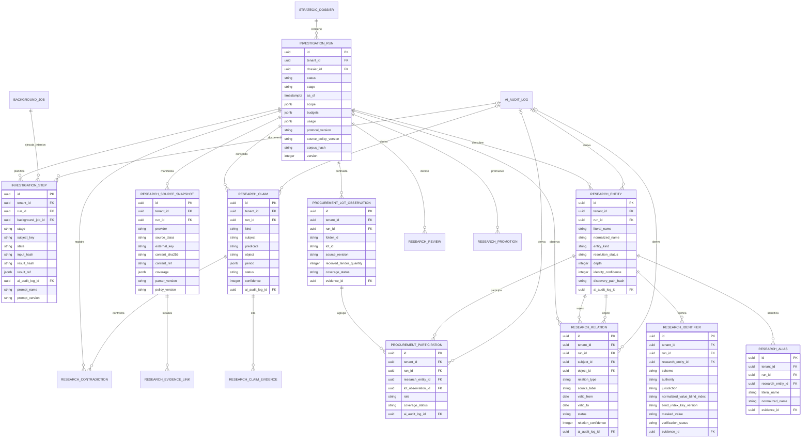

# ORACLE-EXP-INV-01 · ERD propuesto, sin migración

**Estado:** diseño del spike; no existe todavía en PostgreSQL.

## Invariantes

- Todas las tablas son tenant-scoped; `tenant_id` se deriva de sesión/run, nunca del navegador.
- `InvestigationStep` expresa el DAG funcional. `BackgroundJob` conserva la autoridad sobre lease,
  heartbeat, fencing, retry e intentos; no se crea una segunda máquina de ejecución.
- Las constraints de idempotencia usan al menos `tenant_id + run_id + stage + subject_key +
  input_hash`.
- `ResearchEntity` y `ResearchRelation` son candidatos aislados. No comparten IDs ni escritura
  implícita con `Actor`/`Relationship`.
- Identidad y relación tienen confianza separada. Solo coincide un identificador cuando `scheme`,
  `authority`, `jurisdiction` y valor normalizado son iguales. Para identificadores personales, el
  valor persistido usa índice ciego HMAC tenant-scoped con clave versionada/rotable y forma
  enmascarada; un SHA-256 simple no sirve por ser enumerable. Las personas sin prueba inequívoca
  requieren revisión humana.
- `ProcurementLotObservation` es única por run, expediente, lote y revisión y guarda el recuento
  una sola vez. `ProcurementParticipation` es única por run, entidad, observación y rol.
- Las fuentes conservan manifest, hash, localizador, parser y cobertura. El bruto completo queda en
  Signal o caché temporal salvo decisión explícita que modifique D-028.
- Cada claim factual tiene al menos una evidencia aceptada. Opinión y recomendación referencian
  claims; no introducen hechos nuevos.
- Todo candidato derivado por IA conserva `AIAuditLog`, prompt/version y evidencias de origen; los
  resultados deterministas dejan esos campos nulos y registran parser/policy en la fuente.
- `ResearchReview` es append-only. Una promoción a dominio canónico es otra acción idempotente,
  autorizada y auditada; nunca un side effect de la inferencia.
- La cancelación impide publicar dependencias nuevas, pero conserva los resultados ya asentados y
  permite auditoría.

## Índices y constraints a validar en Fase 1

- índices compuestos por `tenant_id, run_id, status/stage`;
- unicidad de source snapshot por `run_id, provider, external_key, content_sha256`;
- unicidad de alias/identificador normalizado dentro del candidato, sin imponer unicidad global a
  nombres de personas;
- unicidad de observación de contratación por `run_id, folder_id, lot_id, source_revision`;
- constraint de presupuesto/uso no negativa;
- optimistic concurrency mediante `version`;
- RLS como defensa en profundidad después del scoping de repositorio;
- conteo de filas existente antes de cualquier futura migración; este spike crea cero filas.
