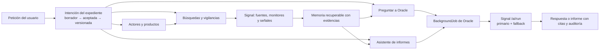

# Plan inicial · intención, memoria, vigilancia e informes del expediente

**Estado:** borrador de arquitectura para validación de producto

**Fecha:** 2026-07-31

**Ámbito:** OPN Oracle + contratos con OPN Signal
**Ramas auditadas:** Oracle `master`/`oracle-dev`; Signal `main`/`signal-dev`

## 1. Conclusión ejecutiva

La petición encaja con la tesis original de Oracle, pero no debe resolverse añadiendo campos y
automatizaciones independientes a cada tipo de expediente. La pieza que falta es una **intención
aceptada y versionada del expediente**: qué busca el usuario, para qué decisión, con qué alcance,
actores, productos, fuentes, geografía, horizonte y criterios de éxito. Esa intención debe ser el
origen trazable de la vigilancia, las búsquedas de licitaciones, las preguntas al Oráculo y los
informes.

El reparto recomendado es:

- **Oracle** conserva la intención, la memoria de negocio, las decisiones humanas, el estado
  durable de cada trabajo y los artefactos del expediente.
- **Signal** conserva y opera las fuentes, monitores, corpus normalizado, búsqueda, gobierno de IA,
  proveedor/modelo, fallback y contabilidad de uso.
- **PostgreSQL de Oracle**, no Redis ni Signal, sigue siendo la verdad del estado que ve el usuario:
  pendiente, generando, reintentando, listo, fallido o cancelado.
- Una llamada IA de Signal es un intento gobernado dentro de un `BackgroundJob` de Oracle. No se
  crearán dos orquestadores autoritativos para un mismo informe.

El resultado de producto debe ser este flujo:



## 2. Estado real de las ramas

### 2.1 Oracle

La comparación se hizo sobre refs actualizadas el 2026-07-31, sin cambiar de rama:

- `master` termina en `93e477e` y está 7 commits por delante del ancestro común.
- `oracle-dev` termina en `eb61173` y está 6 commits por delante del mismo ancestro
  (`71c7552`).
- Las siete diferencias exclusivas de `master` son principalmente operación del monitor diario,
  gasto OpenRouter y ranking de almacenamiento.
- `oracle-dev` contiene el cambio funcional `e89ffb1`: wizard de Mercado, perfil `market.v1`,
  países UE, actores por rol, barreras como riesgos, decisión propuesta, vigilancia preparada y
  propagación del perfil al contexto IA. También contiene cambios de documentos/dev, selección de
  expedientes y scripts del despliegue nativo.
- El diff de `oracle-dev` desde el ancestro común abarca 26 ficheros, 2.056 inserciones y 213
  eliminaciones. No se observó un conflicto textual de merge en la comprobación read-only, pero las
  ramas deben reconciliarse antes de construir sobre ese intake.
- No debe hacerse un merge funcional ciego: el helper geográfico de `market.v1` limita hoy los
  expedientes a UE-27, aunque Oracle es transversal/global, y exige una corrección explícita antes
  de promoverlo a interfaz canónica.

Capacidades ya existentes que deben reutilizarse:

- `StrategicDossier.profile_config`, objetivos, hipótesis y `Watchlist`.
- Perfil específico `competitive-intelligence.v1` en `master` y `market.v1` en `oracle-dev`.
- `SignalMonitor` y `SignalAvanzaAdapter`, con estado deseado/observado, cursor y salud.
- Wizard, perfiles, ejecución inmediata y vigilancia incremental de licitaciones.
- Actores y candidatos con procedencia y revisión humana.
- `LivingSummary`, resumen contextual nocturno, artefactos IA y feedback.
- Informes con plantillas versionadas, snapshot de evidencia, revisión y PDF.
- `BackgroundJob` durable con idempotencia, progreso, stages, cancelación, reintento, lease,
  recuperación de ejecuciones obsoletas y API de polling.
- `InvestigationRun` como workbench trazable dentro de un expediente.

Huecos principales:

- El intake vive como JSON actual del expediente; no tiene revisiones aceptadas ni una relación
  explícita con cada acción derivada.
- La API de Mercado puede persistir un perfil sin recorrer la frontera de revisión del wizard; la
  materialización depende además del flag `starter`, por lo que hoy puede quedar un perfil válido
  sin los actores, riesgos, tareas o vigilancia esperados.
- Solo inteligencia competitiva y, en `oracle-dev`, Mercado tienen un intake específico. No hay
  todavía un contrato equivalente para licitación/ayuda, investigación y otros tipos.
- El prefill de Mercado se transporta temporalmente con `sessionStorage`; no es memoria durable ni
  permite reanudar o auditar el intake desde otro dispositivo.
- El «Oráculo» actual es un resumen versionado, no un asistente de preguntas persistentes.
- La biblioteca de informes ofrece plantillas y opciones, pero no interpreta un encargo libre del
  usuario como plan de informe revisable.
- El snapshot de informe no incluye todavía toda la intención (`profile_config`, geografía,
  sectores e idiomas) y la selección de evidencia usa ventanas fijas. Antes de crecer en fuentes
  debe sustituirse por recuperación explicable y paginada.
- No existe un read model único que responda qué búsquedas, monitores y generaciones están activos
  dentro del expediente.

### 2.2 Signal

La auditoría separó estado confirmado y trabajo local. La rama se movió mientras se hacía la
revisión, así que estos SHAs son la fotografía de cierre:

- `origin/main` termina en `60a5782`; `origin/signal-dev`, en `f32fed6`. Ambas tienen 4 commits
  exclusivos desde `3b378c9c`; los hotfixes Titan/producción son equivalentes por parche aunque sus
  hashes difieran.
- La mayor parte del release dev ya entró en `main` mediante `06b4b1e`. El diff directo actual deja
  13 ficheros y 5.060 inserciones, de las que casi todas pertenecen al nuevo harness y artefactos
  F0–F4 de migración de modelos; el cambio de runtime material está en gobierno IA y limpieza del
  mapa de conectores.
- `f32fed6` migra en Signal Dev las tres tasks OpenRouter de Oracle a Gemini 3.1 Flash Lite con
  Gemini 3.5 Flash Lite como fallback. El benchmark registra 11 tasks × 3 runs antes/después y un
  coste agregado un 21 % menor, pero el coste de `dossier_situation_summary` subió en la muestra y
  el fallback no se ejercitó. Producción/main no recibió esa migración.
- El checkout local cambió varias veces durante la auditoría por otra sesión: pasó de decenas de
  cambios sin consolidar a `f32fed6` y volvió a mostrar WIP de retención, administración e informes.
  Por tanto, solo se consideran estables los commits; ningún path local sin commit forma parte del
  contrato ni se ha modificado desde Oracle.

Capacidades confirmadas y ya desplegadas/documentadas:

- `/api/v1/ai/run` gobierna cada `task_key`, primario, fallback, timeout, JSON estructurado,
  presupuesto y uso. Devuelve proveedor/modelo reales, `fallback_used`, uso y `request_id`.
- `dossier_situation_summary`, `competitive_procurement_intelligence` y
  `entity_dossier_intelligence` usan hoy OpenRouter en la política confirmada; `report_writer`,
  briefings, wizard de completitud, tender summary y reviewer usan Ollama con Titan como fallback.
- Los monitores Oracle soportan `draft|active|paused|error|disabled`, salud, sync idempotente y
  cadencias `hourly|daily|weekly`.
- Signal ya centraliza conectores y fuentes oficiales/web, contratación, BORME, propiedad
  industrial y uso/coste.
- `opn_memory` ya dispone de sources, chunks, observations, facts, conflicts, summaries, context
  builder y analysis runs, pero sus flags están apagados por defecto y el modo demostrado es
  complementario/cacheado. No sustituye todavía la memoria de negocio de Oracle.

Huecos principales:

- `/ai/run` es síncrono. Signal hace failover dentro de la petición, pero no es el historial durable
  del informe del usuario.
- El fallback actual es por configuración de task y en varias tareas no cruza proveedor: local va
  a Titan y OpenRouter va a otro modelo OpenRouter. El patrón «OpenRouter rápido → Ollama local»
  solicitado requiere política, clasificación y pruebas nuevas; no existe por asumir dos modelos.
- `AIUsageLog` deja trazabilidad del resultado final y del fallback, pero hace falta verificar si el
  operador puede reconstruir también la causa y duración de cada intento primario/secundario.
- El contrato de monitor no expresa aún intención, actor, producto o acción de negocio; los
  monitores Oracle terminan en `web_search` y `source_types`/geografía/idioma son principalmente
  metadata, no selección garantizada de los conectores ricos del catálogo. Tampoco hay listado
  canónico de monitores ni watchdog Signal para despejar un `run_state=running` tras morir el
  worker.
- La sección denominada «news» sigue siendo búsqueda web por nombre; aún no es un feed de noticias
  con fecha, medio e identidad desambiguada garantizados.
- El motor `opn_memory` no tiene todavía un contrato productivo Oracle para recuperar contexto de
  expediente. Integrarlo exige decidir frontera HTTP/paquete sin dar acceso directo a la base de
  Signal. Además, su objetivo representa hoy la pregunta corriente, no la intención durable; los
  consumidores productivos no aplican aún el scope de aislamiento y sus analysis requests carecen
  de CAS de arranque, heartbeat, cancelación y recuperación completas. Activarlo antes de cerrar
  esos puntos sería un riesgo P0 de aislamiento y de trabajos pendientes indefinidos.
- Hay que probar por contrato que `enabled=false` de una task impide resolverla, no solo que el
  catálogo expone el flag.

## 3. Decisión de arquitectura propuesta

### 3.1 La intención aceptada es el origen, no un texto decorativo

Crear `DossierIntentRevision` (nombre final pendiente) como agregado tenant-scoped:

| Campo | Finalidad |
|---|---|
| `dossier_id`, `version` | revisión monotónica por expediente |
| `schema_key`, `schema_version` | contrato de Mercado, licitación/ayuda, investigación, etc. |
| `request_text` | petición original del usuario, inmutable en esa revisión |
| `structured_spec` | objetivo, decisión, alcance, actores, productos, fuentes y criterios |
| `status` | `draft|accepted|superseded|rejected` |
| `source_refs` | documentos/URLs/evidencias usados en el intake |
| `content_hash` | identidad canónica de la revisión |
| `created_by`, `accepted_by`, fechas | trazabilidad humana |

`StrategicDossier.current_intent_revision_id` apunta a la revisión aceptada. `profile_config` se
mantiene durante una migración expand/contract como proyección compatible; no seguirá creciendo
como bolsa sin historial.

La revisión se descompone en dos proyecciones con identidad estable:

- `IntelligenceRequirement`: pregunta/decisión que se quiere resolver, prioridad, horizonte,
  criterios de éxito y restricciones;
- `DossierOffering`: producto, servicio o capacidad propia que puede originar búsquedas de mercado
  o contratación sin confundirla con un actor externo.

Cada acción derivada debe guardar al menos:

- `intent_revision_id`;
- hash del scope efectivo;
- origen `user|intake|assistant|signal`;
- usuario que confirmó la acción;
- diferencias aplicadas manualmente respecto a la propuesta.

Aceptar una nueva revisión no reconfigurará silenciosamente acciones existentes. Las dependencias
quedarán en `alignment_state=needs_review` hasta que un usuario adopte el nuevo alcance, conserve
el anterior o cree una acción sucesora.

Así una respuesta puede explicar no solo qué sabe Oracle, sino **qué estaba intentando resolver el
usuario cuando se creó la vigilancia o el informe**.

### 3.2 Intake por schema, no ramas de código ilimitadas

Primera familia de schemas:

| Schema | Contenido específico |
|---|---|
| `market.v1` | oferta, decisión, segmentos, geografía, canales, competidores, aliados, reguladores, barreras y KPIs |
| `procurement.v1` | producto/capacidad, CPV, compradores, elegibilidad, exclusiones, territorios, plazos y go/no-go |
| `research.v1` | pregunta, tesis, sujetos, relaciones, periodo, fuentes permitidas/excluidas, profundidad y criterio de cierre |
| `competitive-intelligence.v2` | oferta, competidores/aliados, comparables, contratación, fuentes y señales de cambio |
| `custom.v1` | objetivo, decisión, entidades, términos, fuentes, horizonte y definición de terminado |

El agente de intake produce un **borrador validado**, nunca activa búsquedas, crea hechos ni llama a
fuentes por su cuenta. El usuario revisa y acepta. La materialización de objetivos, hipótesis,
actores, riesgos, tareas y borradores de vigilancia es determinista y auditable.

«Investigación» puede ser un tipo visible de expediente, mientras `InvestigationRun` sigue siendo
la ejecución trazable disponible también para otros tipos. Debe cerrarse esta decisión antes de
cambiar el enum y las rutas.

### 3.3 Seguimiento selectivo de actores y productos

Desde cada actor vinculado al expediente se ofrecerán acciones independientes:

1. seguir noticias/menciones;
2. seguir publicaciones oficiales;
3. buscar licitaciones convocadas o asociadas al actor;
4. buscar adjudicaciones/actividad competitiva del actor;
5. usar el actor en la búsqueda de oportunidades para nuestros productos;
6. no seguirlo, conservándolo solo como contexto.

Para la oferta propia se ofrecerá «Buscar licitaciones que encajen con nuestros productos o
capacidades», reutilizando `ProcurementSearchProfile` y su aceptación humana.

No se reemplazarán `Watchlist`, `SignalMonitor` ni `ProcurementSearchWatch`. La primera entrega
creará un read model y una capa de comandos que compilen la elección del usuario a esos recursos.
Solo se añadirá un agregado `DossierAutomation` si durante el spike se demuestra que no puede
mantenerse un estado coherente agregando los recursos existentes.

Cadencias visibles recomendadas:

- `manual`;
- `hourly`;
- `daily`;
- `weekly`.

Signal ya admite las tres cadencias automáticas para monitores. La vigilancia local de
licitaciones, hoy despachada por un scheduler de 15 minutos, debe respetar un `next_run_at` por
vigilancia para que el tick interno no equivalga a la frecuencia elegida por el usuario.

### 3.4 Nueva sección «Actividad» del expediente

Ruta propuesta: `/app/dossiers/{id}/activity` y
`GET /api/v1/dossiers/{id}/activity`.

El endpoint será un read model Flask, no un fan-out desde React. Mostrará:

- intención aceptada y revisión vigente;
- monitores de fuentes/actores;
- búsquedas guardadas y vigilancias de licitación;
- investigaciones activas;
- resúmenes, preguntas e informes en ejecución;
- última ejecución, próximo run, cobertura y novedades;
- estado deseado/observado, error seguro y acción disponible;
- coste/uso agregado cuando el permiso lo permita.

Estados de producto: `Preparado`, `Activo`, `Pausado`, `Pendiente`, `En ejecución`, `Reintentando`,
`Necesita atención` y `Finalizado`. El color nunca será la única señal.

## 4. Memoria para «Preguntar a Oracle»

### 4.1 Tres capas, con propietarios claros

1. **Memoria canónica Oracle:** intención aceptada, objetivos, hipótesis, actores, relaciones,
   oportunidades, riesgos, decisiones, tareas, reuniones, informes y feedback.
2. **Memoria probatoria:** evidencias citables y snapshots; Signal conserva corpus/fuentes y Oracle
   congela solo referencias, hashes y extractos usados.
3. **Memoria conversacional:** preguntas y respuestas del expediente, sus citas, revisión de
   contexto y correcciones humanas.

No se enviará «toda la información» al modelo. Un `DossierContextBuilder` recuperará por la
pregunta, la intención y las entidades implicadas, aplicará permisos/clasificación, priorizará
evidencias y declarará recortes, fuentes fallidas y ausencias.

### 4.2 Pirámide de procesamiento de memoria

Las tres capas anteriores describen propiedad de negocio. Dentro de ellas, el procesamiento seguirá
cinco niveles para que la ventana de contexto nunca se convierta en base de datos:

| Nivel | Contenido | Regla |
|---|---|---|
| 0. Fuente | documento, señal, reunión, nota o payload original | inmutable mientras su política de retención permita conservarlo; checksum, fecha, clasificación y ACL |
| 1. Fragmento | unidad semántica con posición y jerarquía | se busca y reprocesa sin perder la referencia al original |
| 2. Observación | entidad, afirmación, compromiso, riesgo, relación o fecha extraídos | salida candidata; no es un hecho por provenir de un modelo |
| 3. Consolidación | hechos vigentes, contradicciones y resúmenes vivos versionados | combina deltas, evidencia y reglas de vigencia; nunca borra la historia |
| 4. Contexto de consulta | selección específica para una pregunta o informe | snapshot acotado, explicable y desechable; no memoria autoritativa |

El sistema distinguirá explícitamente:

- **semántica:** hechos relativamente estables y confirmados;
- **episódica:** reuniones, señales, publicaciones y cambios fechados;
- **relacional:** actores, roles y relaciones con vigencia/procedencia;
- **operativa:** requisitos, búsquedas, decisiones, tareas y compromisos;
- **inferida:** hipótesis, riesgos, oportunidades e insights, siempre separados de los hechos.

El modelo puede extraer «la persona X afirma Y», pero no promoverá automáticamente Y a hecho. Una
evidencia posterior incompatible crea un conflicto; no sobrescribe el dato anterior. La
consolidación conserva soporte, oposición, vigencia, fiabilidad de fuente, confianza de extracción
y estado `candidate|confirmed|disputed|contradicted|superseded|expired|rejected`.

Esta pirámide no obliga a duplicar tablas. Los documentos/chunks y evidencias ya existentes en
Oracle, junto con sources/chunks/observations/facts/conflicts de `opn_memory`, se mapearán mediante
contrato. Oracle solo promoverá a su memoria canónica lo que corresponda al expediente y a una
decisión humana o regla determinista autorizada.

No es una construcción greenfield: `opn_memory` ya implementa source/chunk/observation/fact,
evidencia de soporte/contradicción, resúmenes versionados, `tsvector`, `pg_trgm` y context builder.
La fase propuesta debe endurecer su aislamiento y lifecycle, conectarlo por un contrato explícito
y medirlo; no recrear el mismo modelo dentro de Oracle.

### 4.3 Ingesta y consolidación incremental

El pipeline será determinista y compuesto por tareas pequeñas, no por agentes autónomos que se
envían contexto libre entre sí:

```text
fuente nueva → normalizar → fragmentar → extraer observaciones
             → enlazar entidades → detectar conflictos → consolidar
             → actualizar resumen vivo → dejar disponible para recuperación
```

Reglas iniciales:

- fragmentar por límites semánticos —sección, asunto, cambio de tema, tabla o tramo de reunión—;
  un rango de tokens solo será un guardarraíl medido, no una frontera ciega;
- validar cada extracción con schema estricto; una salida inválida no se guarda como observación
  válida;
- usar una idempotency key equivalente a
  `hash(scope + source_checksum + chunk_hash + job_type + schema_version + model_version + prompt_version)`;
- versionar por separado modelo/dimensión de embeddings, si se habilitan, y permitir reindexar sin
  destruir la versión anterior;
- registrar checkpoint, intento, modelo, prompt, hashes, coste, latencia y error seguro;
- aplicar CAS, heartbeat, retry acotado y estado terminal a cada analysis run de Signal antes de
  integrarlo con Oracle.

Los resúmenes vivos se actualizarán por diferencias:

```text
resumen anterior + observaciones nuevas/modificadas/contradichas = nueva versión
```

Cada versión guardará watermark, entradas utilizadas, cambios, exclusiones, modelo y prompt. Los
triggers podrán ser evento material, volumen acumulado, cierre de episodio y mantenimiento
nocturno/semanal; sus umbrales se fijarán con métricas y no se hardcodeará como regla universal un
número arbitrario de fragmentos.

Compactar reduce lo que debe leer el modelo, no destruye fuentes, evidencias o versiones. Una
política legal/licencia puede expirar contenido original, pero dejará tombstone, hash y auditoría;
esa retención es independiente del resumen.

### 4.4 Modelo mínimo del asistente

- `DossierConversation`: expediente, título, estado y participantes autorizados.
- `DossierMessage`: rol, texto, estado, job, contexto/hash, audit, respuesta estructurada y citas.
- `DossierContextSnapshot`: manifiesto inmutable de revisión de intención, recursos, facts,
  evidencias, límites y timestamp usado en cada respuesta.

Flujo:

1. `POST /api/v1/dossiers/{id}/assistant/messages` persiste la pregunta y devuelve `202` con job.
2. La UI muestra inmediatamente «Pendiente» y conserva el hilo aunque el usuario navegue.
3. Oracle construye/fija el snapshot y llama a Signal con una task nueva y desambiguada, por
   ejemplo `dossier_question_answer`; nunca se reutilizan `oracle_chat`/`oracle_reasoning`.
4. Signal elige primario/fallback; Oracle valida schema y citas y persiste la respuesta.
5. El usuario puede corregir, marcar útil/no útil o convertir una recomendación en acción mediante
   confirmación explícita.

Para una experiencia interactiva se recomienda que Signal configure OpenRouter rápido como
primario y un modelo local como fallback, sujeto a clasificación, presupuesto y métricas. Oracle
solo envía `task_key`; no fija proveedor ni modelo.

## 5. Gestión de muchas fuentes

«Meter todas las fuentes» se tratará como cobertura administrada, no como copiar todo a cada
expediente:

| Capa | Responsabilidad |
|---|---|
| Catálogo Signal | fuente, conector, licencia, frescura, coste, salud y capacidades |
| Corpus Signal/opn_memory | contenido normalizado, chunks, facts/conflictos y retención |
| Oracle | selección para el expediente, evidencia promovida, contexto, decisión y artefacto |

Cada pregunta o informe guardará un `coverage_manifest` con:

- fuentes solicitadas, consultadas, disponibles, fallidas y excluidas;
- fecha de corte y ventana temporal;
- items recibidos frente a usados;
- límites del proveedor y recorte local;
- hashes y locators de lo citado;
- clasificación, licencia/retención y redacción aplicada.

La recuperación será híbrida y respetará este orden:

1. derivar tenant, permisos, clasificación y entidades autorizadas **antes** de recuperar texto;
2. obtener datos exactos y filtros estructurados desde PostgreSQL —IDs, fechas, importes, códigos,
   estados y denominaciones—;
3. combinar PostgreSQL full-text con intención, entidades y ventana temporal;
4. añadir búsqueda vectorial solo si una evaluación demuestra mejora de recall/precisión sin
   degradar aislamiento ni latencia;
5. incorporar relaciones y evidencias contradictorias;
6. reordenar por autoridad, relevancia, recencia, diversidad y fiabilidad.

No se introduce Qdrant ni otro datastore en el primer release. PostgreSQL y full-text son la base;
`pgvector` se evaluará con un corpus y preguntas representativas antes de aceptarlo. La búsqueda
vectorial nunca sustituirá coincidencia exacta para CIF, CPV, expedientes, importes o fechas.

El primer release usará el contexto y evidencias que Oracle ya posee. La integración amplia de
`opn_memory` queda como spike posterior con dos alternativas aceptables:

1. endpoint interno y versionado de contexto/evidencia bajo el namespace Oracle de Signal; o
2. paquete compartido versionado con puertos, sin acceso de Oracle a tablas privadas de Signal.

No se importará el repositorio de Signal desde Oracle, no se consultará su PostgreSQL directamente
y no se convertirán summaries de IA en hechos canónicos sin revisión.

## 6. Asistente de informes

El asistente no generará directamente desde una frase libre. Hará un flujo de dos pasos:

1. **Encargo y plan:** el usuario explica qué quiere; Oracle propone audiencia, preguntas,
   alcance, secciones, fuentes, periodo, longitud, clasificación y formatos.
2. **Confirmación y generación:** el usuario modifica/acepta el plan; Oracle congela el snapshot,
   crea `Report` + `BackgroundJob` y empieza la generación.

El plan aceptado se conserva dentro de `Report.options` o en una entidad `ReportBriefRevision` si
necesitamos varias iteraciones antes de generar. La decisión se tomará tras probar el flujo, no de
forma anticipada.

Etapas visibles de generación:

```text
Pendiente → preparando contexto → generando esquema → redactando
          → revisando evidencias → renderizando → listo
```

Los informes estándar/cortos pueden mantener una sola generación estructurada. Los informes largos
o de investigación deben dividirse por secciones cuando el benchmark muestre que una llamada
única excede contexto, salida o SLO. Cada sección será idempotente y el ensamblador no permitirá
introducir hechos o fuentes nuevos.

Política recomendada en Signal:

- tarea interactiva/plan de informe: proveedor rápido primario, fallback local;
- informe largo: política propia por task, con modelos primario y secundario explícitos;
- reviewer separado solo si recibe el mismo corpus que el writer;
- presupuesto y kill switch por tenant/task;
- respuesta siempre con proveedor/modelo reales, fallback, tokens, coste y `request_id`.

La primera matriz a medir, sin convertirla todavía en decisión de producción, es:

| Task propuesta | Primario candidato | Secundario candidato | Motivo |
|---|---|---|---|
| `dossier_question_answer` | OpenRouter rápido | Ollama/Titan | latencia interactiva con degradación controlada |
| `report_brief_planner` | OpenRouter rápido | Ollama/Titan | plan corto, estructurado y revisable |
| `custom_report_writer` | ganador del benchmark largo | proveedor alternativo | salida extensa, coste y recuperación medibles |

El `report_writer` existente no cambiará por inferencia: hoy sigue Ollama→Titan. El fallback
cruzado de las tasks nuevas solo se activará si Signal demuestra compatibilidad de schema,
privacidad, presupuesto, ventana total de timeout y calidad en ambas rutas.

## 7. Control para que nada quede colgado

La base ya existe en Oracle y debe convertirse en contrato de experiencia:

- `BackgroundJob`: `queued|running|retrying|succeeded|failed|cancelled`.
- `Report`: `draft|generating|ready|reviewed|published|failed|superseded`.
- `JobProgress`: polling, error controlado, cancelar y reintentar.
- lease de ejecución, hard timeout y `recover_stale_jobs` cada cinco minutos.

Trabajo necesario:

1. mapear `Report.status` y job a copy consistente: un report recién creado debe verse como
   «Pendiente de generación», no como borrador ambiguo;
2. mostrar stage, antigüedad, último heartbeat, intento N/M y siguiente reintento;
3. propagar `request_id`/correlation ID Oracle↔Signal y el proveedor/modelo real al audit;
4. hacer cancelación cooperativa entre etapas y no prometer interrupción instantánea durante una
   llamada HTTP ya iniciada;
5. alertar y recuperar automáticamente jobs cuyo lease venza;
6. conservar el último artefacto válido mientras se regenera otro;
7. impedir dobles generaciones con idempotencia y fingerprints de contexto/plan.

### Escalera de timeouts obligatoria

Hay que medir y alinear por task:

```text
deadline del primario + posible fallback + margen de red
  < timeout HTTP de Oracle
  < soft time limit Celery
  < hard time limit Celery
  < lease del BackgroundJob
```

Hoy Signal declara hasta 300 s para tareas largas, mientras el ejemplo de producción de Oracle
declara `ORACLE_SIGNAL_AI_TIMEOUT_SECONDS=210`. Esa divergencia debe resolverse antes de añadir el
asistente de informes; de lo contrario Oracle puede abandonar una petición que Signal todavía está
procesando. No se fijarán nuevos valores sin benchmark de primario, fallback y tamaño de contexto.

## 8. Plan de entrega por slices

| Slice | Resultado | Gate verificable |
|---|---|---|
| 0. Reconciliar ramas y contratos | `oracle-dev` rebasada/integrada selectivamente; Signal WIP limpio; matriz de contratos congelada | sin cambios locales ajenos, CI de ambos SHAs, contract diff revisado |
| 1. Intención v1 | revisión aceptada y trazable para Mercado, licitación/ayuda, investigación, IC y custom | migración expand/contract, backfill contado, tests de tenant/IDOR/versión |
| 2. Actividad y cadencias | actor/producto seleccionable, monitor/búsqueda activable y sección Actividad | create/pause/resume/error por HTTP real; next run coincide con cadencia |
| 3. Memoria recuperable | pirámide fuente→fragmento→observación→consolidación→snapshot | idempotencia, contradicciones, citas, truncación, anti-inyección y aislamiento |
| 4. Preguntar a Oracle | hilo persistente con respuesta asíncrona y acciones confirmables | pregunta devuelve 202; navegación no pierde estado; fallo termina/reintenta |
| 5. Asistente de informes | encargo libre → plan revisable → informe durable | pending inmediato, snapshot fijo, cancel/retry, HTML/PDF, auditoría IA |
| 6. Fuentes a escala | catálogo/coverage manifest e integración medida de `opn_memory` | ninguna fuente fallida se presenta como ausencia; coste/retención visibles |
| 7. Operación y UAT | SLO, alertas, dashboards, pruebas de muerte de worker/proveedor | no queda job no terminal fuera del SLO; restore/restart y E2E verdes |

Secuencia recomendada: 0 → 1 → 2 → 3 → 4 → 5. El slice 6 empieza con un spike en paralelo al
3, pero no bloquea el primer asistente. El slice 7 acompaña a todos y cierra el release.

## 9. Criterios de aceptación del primer release

1. Crear un expediente de Mercado, licitación/ayuda o investigación deja visible la petición
   original y su revisión estructurada aceptada.
2. Toda vigilancia, búsqueda, pregunta e informe permite identificar la revisión de intención que
   la originó.
3. Un competidor puede conservarse sin seguimiento o activar, por separado, noticias,
   publicaciones oficiales y contratación.
4. La oferta propia puede originar una búsqueda de licitaciones revisable sin activar vigilancia
   implícitamente.
5. El usuario elige `manual|hourly|daily|weekly` y ve próxima/última ejecución, novedades y error.
6. «Actividad» muestra todos los procesos activos del expediente con acciones autorizadas.
7. Preguntar a Oracle devuelve una respuesta persistente con citas o declara que no hay evidencia
   suficiente; nunca inventa una fuente.
8. Un informe solicitado queda visible como pendiente antes de llamar al modelo y sobrevive a
   navegación, reinicio de web y reinicio de worker.
9. Un timeout primario con fallback válido, una caída de Signal y una muerte de worker se prueban
   por mutación/fault injection y terminan en éxito recuperado o fallo accionable, nunca en espera
   indefinida.
10. Los manifests explican qué fuentes y cuántos elementos entraron, fallaron o fueron recortados.
11. Los permisos, RLS y negative tests impiden leer conversaciones, jobs, fuentes o informes de
    otro tenant.
12. OpenAPI, cliente TypeScript, métricas, auditoría y runbooks quedan alineados con los dos repos.
13. Una afirmación extraída no se convierte en hecho sin consolidación; evidencia incompatible
    produce un conflicto visible y conserva ambas procedencias.
14. Repetir la ingesta con la misma idempotency key no duplica fragmentos, observaciones, hechos ni
    coste; cambiar schema/modelo crea una versión nueva auditable.
15. Compactar o regenerar un resumen no elimina la fuente, evidencias ni versiones anteriores,
    salvo una retención explícita que deja tombstone y auditoría.
16. Tenant, ACL y clasificación se aplican antes de full-text/vector; un chunk no autorizado nunca
    llega al reranker ni al modelo.

## 10. Decisiones abiertas antes de implementar

1. Confirmar si «Investigación» será un tipo de expediente visible o solo una capacidad
   transversal. Recomendación: tipo visible más `InvestigationRun` transversal.
2. Confirmar si licitación y ayuda comparten `tender_or_grant` con subtipo o se separan en la UX.
3. Acordar el propietario y contrato de la memoria probatoria de `opn_memory` sin acceso directo a
   la base de Signal.
4. Elegir cadencias y SLO por clase de fuente; el mínimo real de los monitores Signal es una hora.
5. Fijar política de datos y presupuesto para OpenRouter en preguntas y reportes personalizados.
6. Decidir si un informe personalizado requiere aprobación del plan siempre o puede existir un
   modo rápido para usuarios con permiso específico.
7. Definir retención de conversaciones y si sus preguntas/respuestas pueden entrar en la memoria
   canónica solo tras aceptación.
8. Cerrar la política de noticias con fecha/medio/desambiguación antes de denominarla seguimiento
   periodístico completo.
9. Medir PostgreSQL full-text solo frente a full-text + `pgvector`; no añadir vector database ni
   embeddings al core sin mejora demostrada y plan de reindexado versionado.
10. Definir watermarks, triggers y SLO de consolidación incremental por tipo de fuente, evitando un
    umbral universal de fragmentos.
11. Fijar retención/licencia de fuentes originales, chunks, conversaciones y embeddings, incluida
    la semántica de tombstone cuando deba eliminarse contenido.

## 11. Primer bloque ejecutable recomendado

Abrir una fase corta que entregue, en este orden:

1. reconciliación selectiva de `oracle-dev` sobre `master`, conservando `market.v1` sin activar
   automáticamente monitores;
2. ADR y migración de `DossierIntentRevision` con backfill de `profile_config` competitivo/mercado;
3. endpoint read-only de Actividad agregando monitores, watches y jobs existentes;
4. selector de seguimiento del actor con noticias y contratación, y cadencia;
5. task Signal `dossier_question_answer` + pregunta asíncrona mínima usando el context builder de
   Oracle actual;
6. fault tests del timeout ladder antes de abrir el Asistente de Informes.

Este bloque valida la arquitectura con valor visible sin esperar a integrar todo `opn_memory` ni a
reescribir el reporting que ya funciona.
